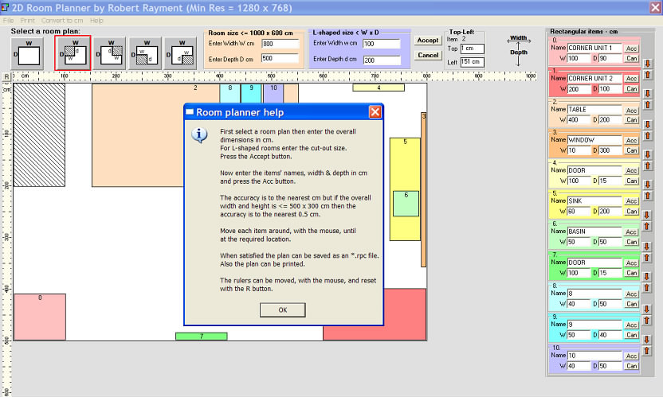



## Simple 2D Room Planner

### Description

Simple 2D Room Planner by Robert Rayment. This basic room planner proved useful to a friend, so maybe for some of you. Note that the minimum screen resolution is 1280 x 768. Zip 29 KB.
 
### More Info
 
*.rpc file

*.rpc file, printer

             |
---                |---
**Submitted On**   |2010-02-28 09:11:02
**By**             |[Robert Rayment](https://github.com/Planet-Source-Code/PSCIndex/blob/master/ByAuthor/robert-rayment.md)
**Level**          |Beginner
**User Rating**    |5.0 (15 globes from 3 users)
**Compatibility**  |VB 6\.0
**Category**       |[Complete Applications](https://github.com/Planet-Source-Code/PSCIndex/blob/master/ByCategory/complete-applications__1-27.md)
**World**          |[Visual Basic](https://github.com/Planet-Source-Code/PSCIndex/blob/master/ByWorld/visual-basic.md)
**Archive File**   |[Simple\_2D\_217600312010\.zip](https://github.com/Planet-Source-Code/robert-rayment-simple-2d-room-planner__1-72956/archive/master.zip)

### API Declarations

See code

